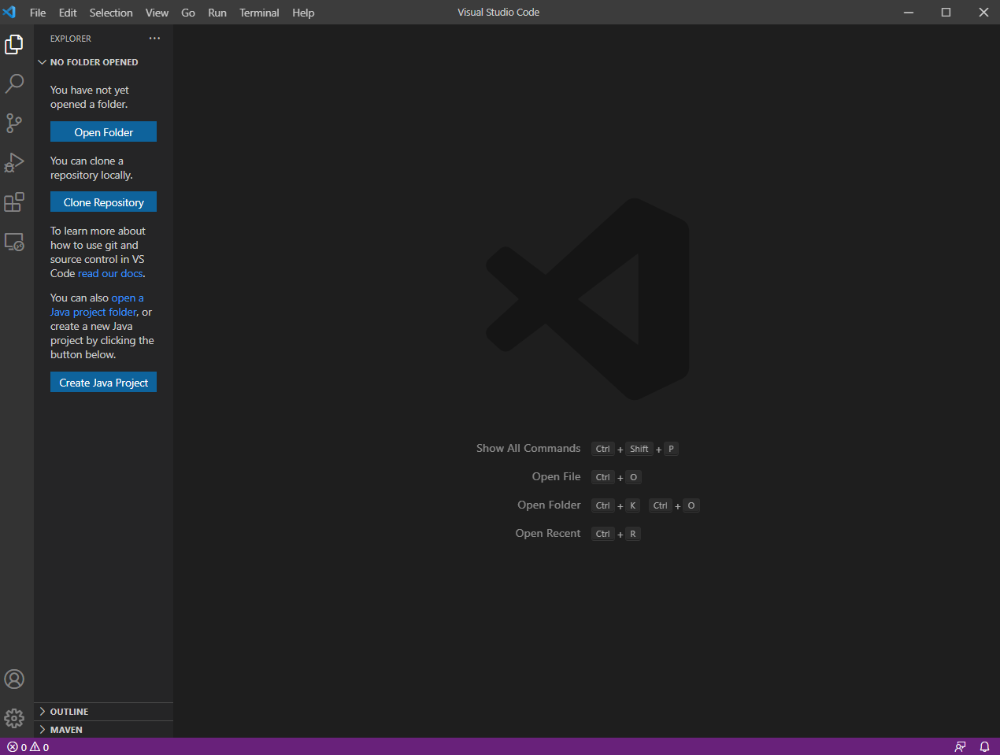

# Remote Access
---
## Week 2 Lab Report - January 13, 2022
---
<br/>

# 1. Installing VSCode <br/>
Download and install [Visual Studio Code](https://code.visualstudio.com/) onto your computer. Follow the instructions listed on the website. 



# 2. Remotely Connecting <br/>
Use VSCode to connect the client to the remote server (in this case ieng6). For Windows, you need to first install [OpenSSH](https://docs.microsoft.com/en-us/windows-server/administration/openssh/openssh_install_firstuse) to that you are able to connect remotely. Next, look up your course account using [UCSD Account Lookup](https://sdacs.ucsd.edu/~icc/index.php) and reset the password if needed. 
<br/>
Now connect to the remote server via VSCode. Open a terminal (Terminal -> New Terminal) and type in the command:
```
$ ssh cs15lwi22aqx@ieng6.ucsd.edu
```
type in your password and then you will be connected. 


# 3. Trying Some Commands <br/>
In the VSCode terminal, you can run some commands:
<br/>
`cd`: change directory <br/>
`cd ~`: change to home directory <br/>
`cd ..`: go up one directory/parent directory <br/>
`ls`: list files in current directory <br/>
`ls -l`: long listing <br/>
`ls -a`: list all (because ls hides files starting with . ) <br/>
`ls <folder name>`: list contents of that folder <br/>
`pwd`: print working directory <br/>
`~`: home directory <br/>
`mkdir`: make directory <br/>
`rmdir`: remove directory <br/>
`touch`: make file <br/>
`rm`: remove file <br/>
`scp`: secure copy file <br/>
<br/>
specific to ssh login/out: <br/>
`ssh`: secure shell <br/>
`exit `or `ctrl-D`: logout of ssh <br/>


# 4. Moving Files with `scp` <br/>
The `scp` commands allows us to copy files between the client and server. After creating a file on the local computer (in this case the file is called WhereAmI.java), run the command:
```
$ scp WhereAmI.java cs15lwi22aqx@ieng6.ucsd.edu:~/
```
The `cs15lwi22aqx@ieng6.ucsd.edu:~/` is where the `WhereAmI.java` file will be copied to. In this case, it is copied to the home directory of my account.  


# 5. Setting an SSH key <br/>


# 6. Optimizing Remote Running <br/>


scp <file to copy> <ssh cs15lwi22aqx@ieng6.ucsd.edu:~