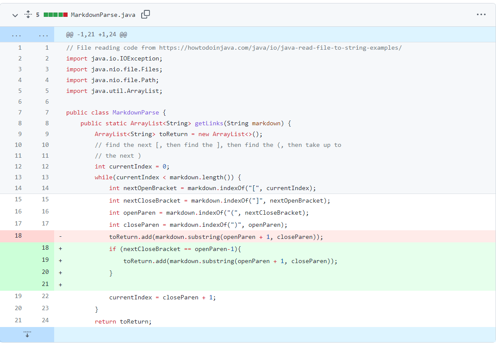
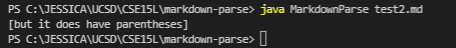
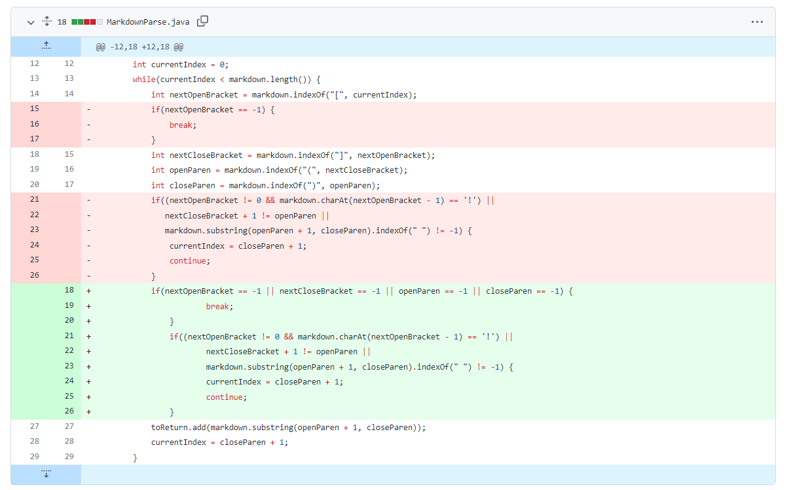
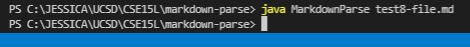

# Testing/Debugging
---
## Lab 2 Report - January 28, 2022
---
 

# Code Change #1  
If given an image link, the program will print that out. But it should only be printing out website links and not image links. Added an if condition to the while loop to check if there is a "!" before the open bracket. If there is, then it is an image and we do not include it in the output.

Failure-inducing input: [myTest.md](myTest.md)

Symptom: "image.jpg" should not be included in output

---
# Code Change #2  
Parentheses followed by a bunch of text followed by brackets are incorrectly recognized as a link. Fixed by checking if the next open bracket directly follows the closing parentheses. 

Failure-inducing input: [test2.md](test2.md)

Symptom: input is not a correctly formatted link so there should be no output

---
# Code Change #3  
Test files that contained the beginnings of link patterns only (like having "(" or "[") caused an infinite loop. Fixed by adding checks to see if closing link components were found. If not, the while loop is exited and there is no longer an infinte loop. 

Failure-inducing input: [test8-file.md](test8-file.md)

Symptom: infinite loop occurs because the program was searching for the closing link component of either ")" or "]". 

