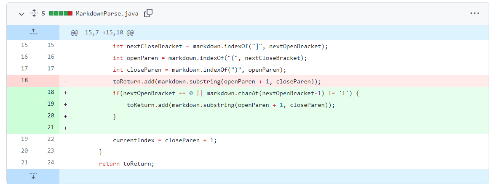
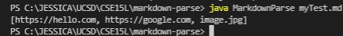

# Testing/Debugging
---
## Lab 2 Report - January 28, 2022
---
 

# Code Change #1  
If given an image link, the program will print that out. But it should only be printing out website links and not image links. Added an if condition to the while loop to check if there is a "!" before the open bracket. If there is, then it is an image and we do not include it in the output.

Failure-inducing input: [myTest.md](myTest.md)

Symptom: "image.jpg" should not be included in output

---
# Code Change #2  

---
# Code Change #3  

