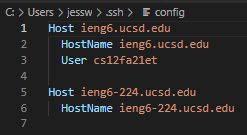
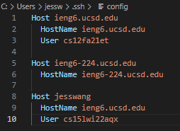
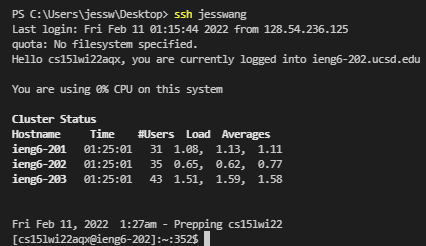

# Streamlining ssh Configuration
---
## Lab 3 Report - February 11, 2022
---
<br/>

1. Find the .ssh/config file and open it with VSCode.


2. To the file, add the lines:
```
Host jesswang
    HostName ieng6.ucsd.edu
    User cs15lwi22aqx
```
The `jesswang` is an alias that you set for `ssh` to interpret and you can use any username you want. 


3. To ssh into the ieng6 server, simply type into the command line:
```
$ ssh jesswang
``


4. You can also use the scp command with the alias. The original command would be 
```
$ scp WhereAmI.java cs15lwi22aqx@ieng6.ucsd.edu:~/
```
but with the alias, you do not need to type out the full course-specifc username anymore (replace with the alias). The new command is:
```
$ scp WhereAmI.java jesswang:~/
```

