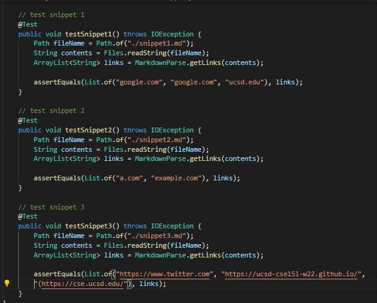
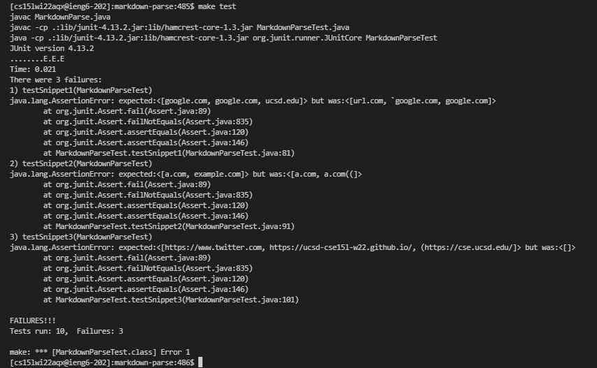
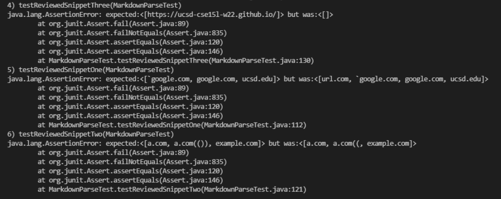

# Testing Code Snippets
---
## Lab 4 Report - February 25, 2022
---

[My markdown-parse repo](https://github.com/jesswang08/markdown-parse.git)

[Reviewed markdown-parse repo](https://github.com/ocboogie/markdown-parse.git)

---

I used the VSCode preview to determine which links are considered links. 

# My code implementation:

Turning my code into tests (in `MarkdownParseTest.java`):

My corresponding output after running the 3 new tests I added:

# Reviewed code implementation:

I used the same tests I wrote for mine to test the repo I reviewed:

Reviewed repo's corresponding output after running the 3 new tests I added:

# Code fixes

Snippet 1

I think there is a small code change that could make the program work. `MarkdownParse.java` would simply need to check for a pair of back ticks. If there are any, the link inbetween would not be considered as a link. 

Snippet 2

I do not think there is a small code change that could make the program work. `MarkdownParse.java` would have to keep track of how many open parentheses it encounters and then ensure that each open parentheses "matches" to a close parentheses. The same would go for open and close brackets. For escaped brackets, the program should be able to determine that there is a bracket missing. 

Snippet 3

I think there is a small code change that could make the program work. `MarkdownParse.java` would need to check for a newline character `\n` to get the entire link. 
