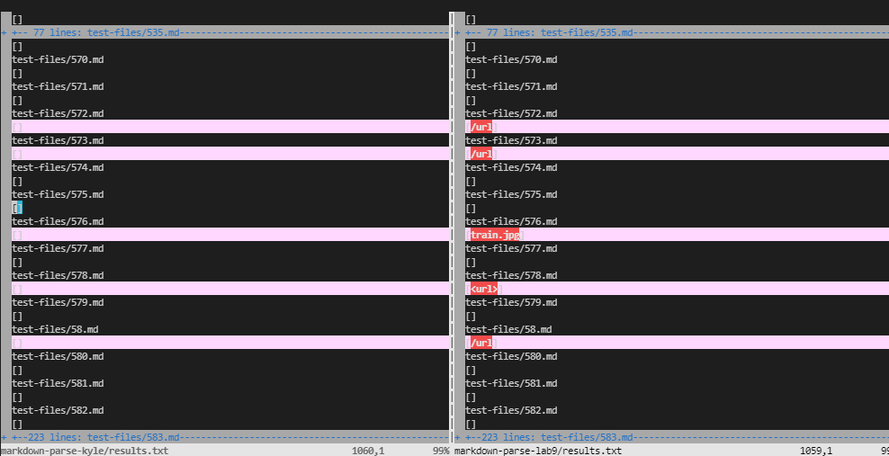
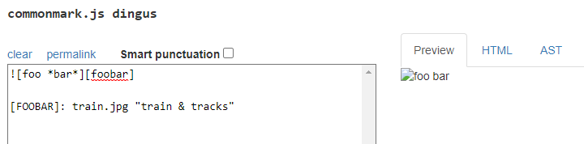
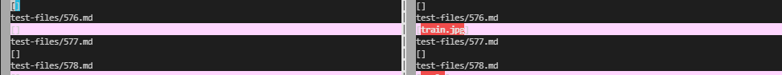
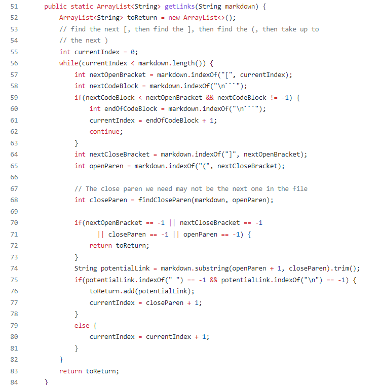
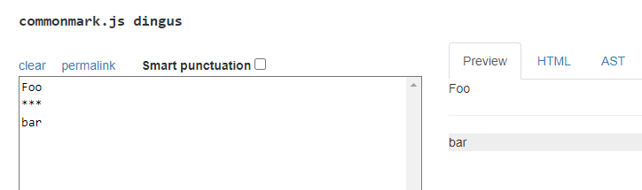
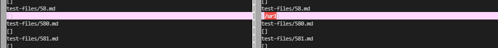

# Comparing MarkdownParse
---
## Lab 5 Report - March 11, 2022
---

# Finding Different Test Results

I stored the outputs of running the tests through each program in a file called `results.txt` in each directory respectively. I used the command:
```
bash script.sh > results.txt
```
I then compared the two result files using the vimdiff command:
```
vimdiff <file1> <file2>
```
I filled in the respective names for the file name and got the result:
 


# Implementation Differences

## Test 1: 576.md

576.md:
```
![foo *bar*][foobar]

[FOOBAR]: train.jpg "train & tracks"
```

According to the commonmark website output, the expected output should be `[]` because the input is an image so it is not included in the output. 



According to this output, my implementation was correct as it didn't print out any links. The reviewed implementation is incorrect because it prints out a link `train.jpg`.



The bug is that the reviewed implementation's getLinks method does not differentiate between links and images. A fix would be to check for an `!` before the open bracket. 




---
## Test 2: 58.md

58.md:
```
Foo
***
bar
```

According to the commonmark website output, the expected output should be `[]` because the input is just text so nothing is included in the output. 

 

According to this output, my implementation was correct as it didn't print out any links. The reviewed implementation is incorrect because it prints out a link `/url`.



The bug is that the reviewed implementation's getLinks method does not check for only a newline character. The method currently checks for `\n``` ` which is a new line character followed by a code block so in the case that there isn't a code block following after, the code does not recognize the newline and it becomes part of the link. 

 
